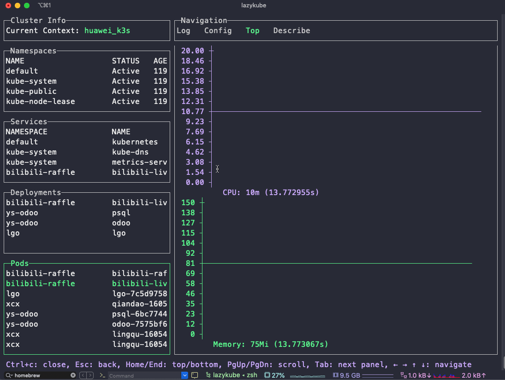
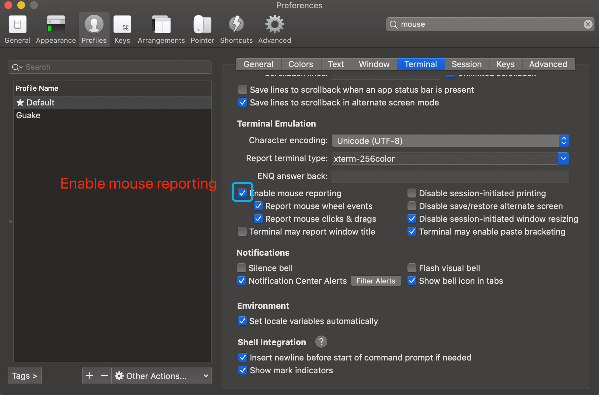

# lazykube
⎈ 通过鼠标和命令行交互的方式来管理 K8s 集群  ([English Document](../README.md) | [中文文档](README_CN.md))
[](https://goreportcard.com/report/github.com/TNK-Studio/lazykube)     



## 安装方式

### Mac Homebrew

#### 安装

```bash
$ brew install tnk-studio/tools/lazykube
```
#### 升级

```bash
$ brew upgrade tnk-studio/tools/lazykube
```

### Linux

```bash
$ curl https://raw.githubusercontent.com/TNK-Studio/lazykube/main/scripts/install_update_linux.sh | bash
```

### Windows

通过下载页面下载并解压 [(link)](https://github.com/TNK-Studio/lazykube/releases/latest).

### Go get

```bash
$ go get -u github.com/TNK-Studio/lazykube
```

## 如何使用

```bash
$ lazykube
```

## 常见问题

* 当使用 iterm2 作为终端时鼠标无法交互 ?



## 更新日志

[更新日志](../CHANGELOG.md)